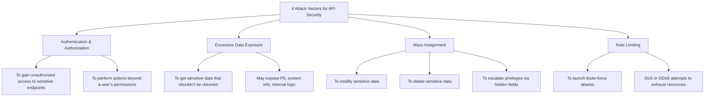

# **API Attack Vectors in Penetration Testing**

Attack vectors are methods or pathways that attackers exploit to gain unauthorized access to systems, networks, or data. In API security, the following four attack vectors are particularly critical from a penetration tester's perspective:

---

#### **1. Authentication and Authorization Flaws**
Penetration testers look for weaknesses in how an API authenticates users and enforces access controls. This includes:
- Bypassing weak authentication mechanisms (e.g., predictable tokens, missing MFA).
- Exploiting poor session management (e.g., JWT reuse or missing expiration).
- Abusing broken authorization checks to access or manipulate resources beyond user privileges.

**Goal**: Gain unauthorized access to sensitive endpoints or perform actions outside the user's intended scope.

---

#### **2. Excessive Data Exposure**
Many APIs expose too much internal data and rely on the client to filter it. Testers inspect responses for:
- Sensitive fields (e.g., PII, tokens, internal IDs).
- Database structure or backend system details.

**Goal**: Identify overexposed information that could aid further exploitation or reconnaissance.

---

#### **3. Mass Assignment**
APIs that bind incoming JSON data directly to backend models without validation can lead to mass assignment vulnerabilities. Testers attempt to:
- Inject extra fields (e.g., `isAdmin: true`, `role: "admin"`).
- Modify hidden or read-only parameters.

**Goal**: Escalate privileges or manipulate protected data via unchecked input.

---

#### **4. Lack of Rate Limiting**
Without rate limiting, attackers can:
- Launch brute-force attacks against authentication endpoints.
- Abuse API functionality with high-volume requests (DoS/DDoS).

**Goal**: Exhaust resources or gain unauthorized access through repeated requests.

---

### **API Security Testing Approaches**

Penetration testers leverage three core testing methods to identify and mitigate these risks:

- **SAST (Static Application Security Testing)**  
  Analyzes source code or configuration files without running the API.  
  *Example: SonarQube.*

- **DAST (Dynamic Application Security Testing)**  
  Tests the API in a running state, simulating real-world attacks.  
  *Example: API Security Scanner tools.*

- **HAST (Human Application Security Testing)**  
  Involves manual and automated context-aware tests.  
  *Example: Postman collection runner for automated security flows.*

---

### **Security Integration in SDLC: Shift Left vs Shift Right**

- **Shift Left Security**:  
  Incorporates security testing early in the software development life cycle.  
  - Identifies vulnerabilities earlier.  
  - Reduces remediation costs.  
  - Promotes secure-by-design practices.

- **Shift Right Security**:  
  Focuses on post-deployment security through:  
  - Continuous monitoring.  
  - Incident response.  
  - Runtime protection and logging.

**Best Practice**: Combine both approaches for end-to-end security coverage throughout the development lifecycle.

---

#  4 Attack Vectors for API Security

---

## 🔐 1. **Authentication & Authorization**

**Explanation**:  
This refers to how the API verifies users (authentication) and controls what they’re allowed to do (authorization). Weaknesses in this layer can allow attackers to:
- **Bypass login systems** (e.g., using predictable or stolen tokens)
- **Access restricted endpoints** by manipulating headers or tokens
- **Escalate privileges** (e.g., accessing admin routes as a standard user)

**Example**: An attacker modifies a JWT token or finds an endpoint that doesn't check the user’s role and performs unauthorized actions.

---

## 🗄️ 2. **Excessive Data Exposure**

**Explanation**:  
APIs often return more data than necessary and rely on the client to filter out what’s not needed. This is dangerous because:
- Sensitive information like passwords, internal system info, or user PII (personally identifiable information) might be exposed.
- Even seemingly harmless data (e.g., internal IDs, debug messages) can help attackers map out the system.

**Example**: A `/user/profile` endpoint returns not just the username, but also `passwordHash`, `securityAnswers`, and internal debug fields.

---

## 💾 3. **Mass Assignment**

**Explanation**:  
This vulnerability happens when the API blindly accepts all incoming fields and binds them directly to internal models or objects without validation.
- Attackers can inject additional fields like `isAdmin: true`, `balance: 9999`, or `emailVerified: true`.
- If the backend allows it, these values overwrite protected ones.

**Example**: A normal user sends `{ "role": "admin" }` during profile update, and due to mass assignment, they become an admin.

---

## 🔨 4. **Rate Limiting**

**Explanation**:  
If an API doesn’t enforce rate limiting, it becomes vulnerable to:
- **Brute-force attacks**: Repeatedly guessing passwords or tokens.
- **Denial of Service (DoS)**: Overwhelming the API with too many requests.

**Example**: An attacker sends 10,000 login attempts in a minute without being blocked, trying to guess credentials.

---

### 🧠 Summary: Why These Matter in API Penetration Testing

| Vector                     | Goal of Testing                               | Real Threat Example                                |
|---------------------------|-----------------------------------------------|----------------------------------------------------|
| **Auth & Authorization**  | Gain access or perform privileged actions     | Bypass auth, escalate role                         |
| **Data Exposure**         | Discover sensitive or internal data           | Exposed PII or database internals                  |
| **Mass Assignment**       | Modify hidden/protected fields                | Change own role to admin                           |
| **Rate Limiting**         | Abuse functionality at scale                  | Brute-force login or API overload                  |

---

# SAST vs DAST vs HAST

**SAST**, **DAST**, and **HAST** — three different **API security testing approaches** — each focusing on different layers of the software development lifecycle. Here's a detailed explanation of each:

---

### 🔍 **SAST** - Static Application Security Testing
**Tagline:** *“Test the code without running it.”*  
**Description:**
- Involves scanning the **API’s source code or definition files** (e.g., OpenAPI/Swagger specs).
- Performed **without executing the API**.
- Helps in **early detection** of security issues during development (Shift Left).
- Tools analyze syntax, control flow, and data flow.

**Example Tool:** SonarQube

**Use Case:**
- Identify hardcoded secrets, insecure functions, or unsafe coding patterns **before deployment**.
- Ideal for developers and CI/CD pipelines.

---

### 🧪 **DAST** - Dynamic Application Security Testing
**Tagline:** *“Test like a hacker would — while it’s running.”*  
**Description:**
- Involves interacting with **live/deployed** APIs to identify vulnerabilities.
- It **simulates real-world attacks** by sending malicious requests to endpoints.
- Often automated using API scanners, fuzzers, or vulnerability testing tools.

**Example Tool:** Burp Suite Web Vulnerability Scanner

**Use Case:**
- Detect issues like authentication bypass, XSS, SQLi, or improper error handling.
- Used during QA or staging before production push.

---

### 🧠 **HAST** - Human Application Security Testing
**Tagline:** *“Context-aware and reusable manual testing, made repeatable.”*  
**Description:**
- Combines **human intelligence** with **automated testing logic**.
- Focuses on **reusable, context-driven test scenarios**, especially in **dynamic environments**.
- Lets testers write test cases that mimic how real users might interact with the API.
- Can be **automated** using tools like Postman.

**Example Tool:** Postman Collection Runner

**Use Case:**
- Best for nuanced, **logic-based testing** where tools like DAST may miss context.
- Excellent for regression testing with changing APIs or microservices.

---

### 📊 Summary Comparison Table:

| Aspect                         | **SAST**                             | **DAST**                                  | **HAST**                                 |
|-------------------------------|--------------------------------------|-------------------------------------------|------------------------------------------|
| Tests                         | Code (static)                        | Running API (dynamic)                     | Human-written test cases                 |
| Execution Needed?             | ❌ No                                | ✅ Yes                                     | ✅ Yes                                    |
| Stage                         | Early (Dev/CI)                       | Later (QA/Staging)                        | Any (esp. dynamic dev environments)      |
| Automation                    | ✅ High                              | ✅ High                                    | ✅ Yes (custom test logic)               |
| Example Tool                  | SonarQube                            | Burp Suite Scanner                        | Postman Collection Runner                |

---
# Shift-Left vs Shift-Right

![[Pasted image 20250429165943.png]]

The concepts of **Shift Left** and **Shift Right** in software development and security refer to **when** in the software development lifecycle (SDLC) certain practices are implemented.

---

## 🔄 Shift Left — **"Secure Early"**
### 👉 *Move security and testing earlier in the SDLC*

### **Goal:**  
Catch and fix issues **as early as possible**, during development and design stages.

### **Why it's important:**
- Fixing a bug in development is **cheaper** than in production.
- Enables **proactive** security and better **DevSecOps** integration.

### **Common Practices:**
- **SAST (Static Testing)**
- **Code reviews**
- **Threat modeling**
- **Unit and integration testing**
- **Secure coding guidelines**

### **Tools/Examples:**
- SonarQube, ESLint, Checkmarx
- Developer security training
- Pre-commit hooks, CI pipeline checks

### ✅ Benefits:
- Early bug detection
- Lower remediation cost
- Stronger secure coding culture

---

## 🔄 Shift Right — **"Protect & Monitor in Production"**
### 👉 *Implement security and testing **after deployment***

### **Goal:**  
Ensure the application remains **secure, stable, and resilient** while it’s running in real-world environments.

### **Why it's important:**
- Real users + real-world conditions can expose unknown risks.
- Needed for **incident detection**, **response**, and **continuous monitoring**.

### **Common Practices:**
- **DAST (Dynamic Testing)**
- **Monitoring & logging**
- **Intrusion detection systems (IDS)**
- **Runtime protection & WAFs**
- **Penetration testing**

### **Tools/Examples:**
- Burp Suite, ZAP
- ELK Stack, Splunk, Prometheus
- SIEM tools, EDR, cloud security services

### ✅ Benefits:
- Detect unknown vulnerabilities
- Improve uptime and resilience
- Faster incident response

---

## 📊 Shift Left vs Shift Right: Comparison

| Feature                     | **Shift Left**                            | **Shift Right**                             |
|----------------------------|-------------------------------------------|---------------------------------------------|
| **Timing**                 | Early in SDLC (development)              | After deployment (production)              |
| **Focus**                  | Prevention, secure coding                | Detection, response, runtime protection     |
| **Tools**                  | SAST, linting, CI/CD security plugins    | DAST, logging, WAFs, runtime monitoring     |
| **Goal**                   | Catch bugs & vulnerabilities early       | Monitor, respond, and mitigate in real time |
| **Cost of Fixing**         | Lower                                    | Higher                                      |
| **Risk Exposure**          | Reduced                                  | Increased if not monitored properly         |

---

## 🧠 Real-World Strategy: Use Both
Modern security approaches like **DevSecOps** embrace **both shift left and shift right**:
- Shift left helps you **build security in**.
- Shift right helps you **respond and adapt** to evolving threats.

