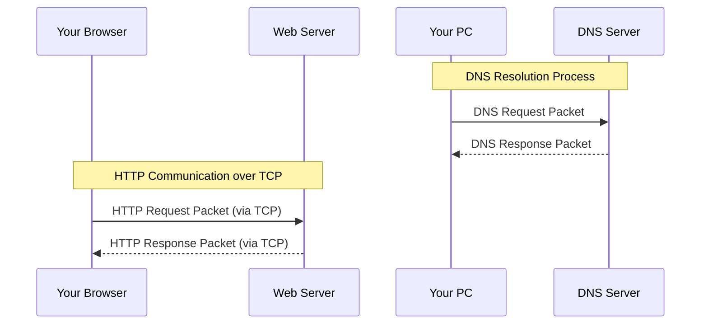

## 🔌 What Are Network Protocols?

Network protocols are **rules and standards** that define **how data is transmitted** across a network. They ensure that two or more devices — regardless of their underlying hardware, operating systems, or architecture — can **communicate reliably and efficiently.**

---

### 💬 **Why Are Protocols Important?**

Without protocols, computers would speak different “languages” and would be **unable to understand each other**. Protocols make sure that:

- Data is **formatted correctly**
    
- Communication is **synchronized**
    
- Devices can **recognize** and **respond** to each other’s messages
    
- **Errors** can be detected and corrected
    

---

### 📦 **How Is Data Transferred?**

When two hosts (like two computers) communicate over a network, their data is **broken down into packets** — small chunks of data — which are then **transmitted via protocols**. Each packet contains:

- The actual data
    
- Source and destination addresses
    
- Protocol-specific information (like sequence numbers, error-checking info)
    

---

## 📘 **Common Network Protocols and Examples**

Here are some widely used protocols, their use cases, and how they work with packets:

---

### 1. **HTTP/HTTPS (HyperText Transfer Protocol)**

- 📌 **Purpose:** Used for web communication (browsing)
    
- 🔒 HTTPS = HTTP + SSL/TLS encryption
    
- 📦 **Packet Example:** When you visit `https://example.com`, your browser sends an **HTTP GET request packet** to the server, and the server replies with a **response packet** containing the webpage.
    

---

### 2. **TCP (Transmission Control Protocol)**

- 📌 **Purpose:** Reliable data transfer (used by HTTP, FTP, SMTP, etc.)
    
- 🧠 Ensures **ordered delivery**, **error checking**, **retransmission**
    
- 📦 **Packet Example:** When downloading a file, TCP ensures all pieces (packets) arrive in the correct order.
    

---

### 3. **UDP (User Datagram Protocol)**

- 📌 **Purpose:** Faster, connectionless data transfer (used by DNS, VoIP, gaming)
    
- ❌ No guarantee of delivery/order
    
- 📦 **Packet Example:** When streaming a video, if a few packets are lost, it doesn't stop playback.
    

---

### 4. **DNS (Domain Name System)**

- 📌 **Purpose:** Resolves domain names to IP addresses
    
- 📦 **Packet Example:** When you enter `openai.com`, your system sends a **DNS request packet**, and the DNS server replies with the **IP address** in a response packet.
    

---

### 5. **ICMP (Internet Control Message Protocol)**

- 📌 **Purpose:** Used for diagnostic tools (like `ping`)
    
- 📦 **Packet Example:** `ping 8.8.8.8` sends ICMP **echo request packets** to Google's DNS server. If reachable, it replies with **echo reply packets**.
    

---

### 6. **FTP (File Transfer Protocol)**

- 📌 **Purpose:** Transfers files over a network
    
- 📦 **Packet Example:** When uploading a file to a remote server, the data is split into multiple TCP packets and reassembled on the other end.
    

---

## 🌐 Visualizing Communication

---

## 🧠 Summary

| Protocol   | Layer       | Use Case             | Reliable?     | Uses Packets? |
| ---------- | ----------- | -------------------- | ------------- | ------------- |
| HTTP/HTTPS | Application | Web                  | Yes (via TCP) | ✅             |
| TCP        | Transport   | File transfer, email | ✅             | ✅             |
| UDP        | Transport   | Streaming, VoIP      | ❌             | ✅             |
| DNS        | Application | Domain resolution    | ✅             | ✅             |
| ICMP       | Network     | Diagnostics          | N/A           | ✅             |

---

## 📦 **What is a Packet?**

A **packet** is the **smallest unit of data** that is transmitted over a network.

Instead of sending an entire file or message in one big chunk, it's **broken into smaller packets**, sent over the network, and then **reassembled** at the destination.

---

### 🔌 **How Are Packets Transmitted?**

Packets travel over **physical media** — such as:

- 🧵 Ethernet cables (via **electrical signals**)
    
- 📡 Wi-Fi (via **radio waves**)
    
- 💡 Fiber optics (via **light pulses**)
    

These signals carry **binary data** — sequences of **1s and 0s** — that computers understand. The network interface (NIC) on each device **translates** the physical signal into digital bits and vice versa.

---

### 🧱 **Structure of a Packet**

![[Pasted image 20250418225954.png]]

A packet isn’t just raw data. It includes **metadata** used for routing, integrity checking, and identifying the type of traffic.

A typical packet contains:

1. **Header** – Control info like:
    
    - Source & destination IP
        
    - Protocol type (TCP/UDP/ICMP/etc.)
        
    - Sequence number
        
2. **Payload** – The **actual data** (e.g., part of an email, image, or webpage)
    
3. **Trailer (optional)** – Error checking info (e.g., CRC for Ethernet)
    

> Think of it like an envelope:
> 
> - Header = the address label
>     
> - Payload = the letter inside
>     
> - Trailer = the security seal

---

### 📶 **Example: Sending a Message**

Let’s say you send “Hello” to a server:

1. Your computer converts “Hello” to binary.
    
2. It splits the binary into packets.
    
3. Each packet has a header with the destination IP.
    
4. Packets travel across routers/switches.
    
5. The server receives and reassembles the packets into “Hello”.

---

### 🌐 **Protocols + Packets = Communication**

Protocols like **TCP**, **UDP**, **ICMP**, etc., define **how packets should be structured and handled**.

- **TCP packets** include sequence numbers to ensure reliable delivery.
    
- **UDP packets** are faster but don’t guarantee delivery.
    
- **ICMP packets** (used in `ping`) are diagnostic messages.

---

### 🔍 **Packet Analysis with Wireshark (Example)**

If you open Wireshark and capture traffic, you might see a TCP packet like this:

- Ethernet II: Source MAC → Destination MAC
    
- IP: Source IP → Destination IP
    
- TCP: Source Port → Destination Port (e.g., 443 for HTTPS)
    
- Data: Payload (e.g., encrypted HTTPS content)
    

Each protocol adds its **own layer of headers**, forming what's called an **encapsulation stack**.

---

### 🧠 Real-World Analogy

Imagine sending a physical letter:

- 📝 Your message = Payload
    
- 📬 The envelope = Header
    
- 📮 Post office uses the envelope info to route the message
    
- ✉️ Each envelope (packet) is delivered separately
    
- 🏠 The receiver opens each envelope and reconstructs your message

---

### 💡 Key Takeaways

- **Packets** are fundamental to all digital communication.
    
- They **carry bits** (binary data) via physical signals like electricity, light, or radio.
    
- Protocols define **how packets are created, sent, routed, and received**.
    
- Tools like **Wireshark** help analyze packets in real-time — super valuable for pentesting.

---

## 🧠 **OSI Model Overview – 7 Layers of Communication**

The **OSI (Open Systems Interconnection)** model is a **conceptual framework** used to understand how data travels from one computer to another over a network. Think of it like a 7-layer cake where each layer has its own job in getting your message across the network.

Here’s your table with expanded explanations + examples:

---

| 🔢 Layer | 📌 Name          | 🛠️ Function                                                                                          | 🔍 Examples                                   |
| -------- | ---------------- | ----------------------------------------------------------------------------------------------------- | --------------------------------------------- |
| 7        | **Application**  | Interfaces directly with software and users. Delivers data to/from applications.                      | **HTTP, FTP, DNS, SSH, SMTP**                 |
| 6        | **Presentation** | Translates, encrypts, or compresses data to a format the application can use.                         | **SSL/TLS**, encryption, **JPEG, GIF**, ASCII |
| 5        | **Session**      | Manages sessions between applications (open/close/maintain). Handles authentication and reconnection. | **NetBIOS, RPC, APIs**                        |
| 4        | **Transport**    | Ensures reliable data delivery between hosts. Handles segmentation, flow control, and error recovery. | **TCP, UDP**                                  |
| 3        | **Network**      | Decides how data is routed between devices on different networks. Uses logical addressing.            | **IP, ICMP, IPSec**                           |
| 2        | **Data Link**    | Ensures reliable data transfer across the physical link. Adds MAC addresses, handles error detection. | **Ethernet, PPP, ARP, Switches**              |
| 1        | **Physical**     | Transmits raw bits over a medium (electrical signals, light, etc.)                                    | **Cables, Hubs, NICs, Wi-Fi, USB**            |

---

### 🧩 **How Data Flows (Encapsulation & Decapsulation)**

When data moves from one device to another:

1. It **starts at Layer 7 (Application)** on the sender’s side and **moves down** through the layers.
    
2. Each layer **adds its own header** (and sometimes trailer) — this is called **encapsulation**.
    
3. At Layer 1, it becomes electrical signals or radio waves and is sent physically.
    
4. On the receiving device, it goes **back up the layers**, with each layer **removing its header** — this is called **decapsulation**.
    

---

### 📡 **Real-World Example: Visiting a Website (HTTPS)**

**You type `https://example.com` into a browser:**

- **Layer 7 (Application):** The browser sends an HTTP request over HTTPS.
    
- **Layer 6 (Presentation):** TLS encrypts the HTTP request.
    
- **Layer 5 (Session):** A secure session is established with the server.
    
- **Layer 4 (Transport):** The encrypted data is segmented into TCP packets.
    
- **Layer 3 (Network):** IP assigns source/destination addresses and routes it.
    
- **Layer 2 (Data Link):** Ethernet adds MAC addresses to the frame.
    
- **Layer 1 (Physical):** Electrical signals are sent through your Ethernet cable or Wi-Fi.
    

---

### 🎯 **Why Is the OSI Model Important in Pentesting?**

|Layer|Pentester Relevance|
|---|---|
|7|Exploiting web apps (XSS, SQLi), APIs, SMTP abuse|
|6|Testing weak SSL/TLS configs, cipher suites|
|5|Hijacking or maintaining sessions (e.g., session fixation, token manipulation)|
|4|Scanning ports, DoS attacks (TCP SYN flood), UDP scanning|
|3|IP spoofing, ICMP tunneling, VPN/encapsulation|
|2|ARP spoofing, MAC flooding, switch attacks|
|1|Physical attacks, cable tapping, USB device injection|

---

### ✅ Quick Memory Trick – OSI Mnemonic

From Layer 7 to 1:

**"All People Seem To Need Data Processing"**  
(Application → Physical)

Or reversed:

**"Please Do Not Throw Sausage Pizza Away"**  
(Physical → Application)

---

## 🧠 **Clarifying the Purpose of the OSI Model**

The **OSI model (Open Systems Interconnection)** isn’t a physical thing — it’s a **conceptual framework** that:

- Helps break down the **complexity** of network communication
    
- Provides a **standardized language** for engineers, admins, and security professionals
    
- Makes it easier to **design**, **troubleshoot**, and **secure** networks
    

Think of it like a **blueprint or map** — you don’t walk on the map, but you use it to understand and navigate the terrain.

---

### 🔍 **Key Points Recap (With Expanded Insight)**

#### ✅ "The OSI model serves as a guideline..."

- It helps **design** protocols and systems that are **interoperable**.
    
- Different vendors can build products (like routers, switches, firewalls) that **work together** if they follow OSI concepts.
    

#### ✅ "It helps organize the complex task of communication..."

- Imagine trying to understand all of networking at once — it's overwhelming!
    
- OSI breaks it into **layers**, where each layer:
    
    - Has its own **functions**
        
    - Talks only to the **layer above and below**
        
    - Can be **independently designed and updated**
        

### ⚠️ "The OSI model is not a strict blueprint..."

- Real-world networks often use the **TCP/IP model**, which is more practical and condensed (4 layers vs. 7).
    
- But OSI is still taught because it's **better for learning**, and tools like Wireshark, Nmap, and Metasploit often map cleanly to OSI layers.
    

---

## 🌐 **Where You’ll See OSI in Action (as a Pen Tester or Analyst)**

|Scenario|OSI Layer(s) Involved|Explanation|
|---|---|---|
|Web app pentesting (XSS, SQLi)|Layer 7|You're interacting with application-level protocols (HTTP/HTTPS)|
|SSL certificate inspection|Layer 6|Presentation layer handles encryption|
|Session hijacking|Layer 5|Targeting how sessions are initiated/managed|
|TCP port scanning (Nmap)|Layer 4|Scanning for open TCP/UDP ports|
|IP spoofing, traceroute|Layer 3|Involves IP headers, routing|
|ARP poisoning|Layer 2|Exploiting MAC-based addressing|
|Sniffing Wi-Fi or physical taps|Layer 1|Capturing raw signals or cable-level traffic|

---

## 🧪 Want a Quick Practice Exercise?

Here’s a mini challenge:

**Scenario:** You're performing a MITM attack and capturing encrypted traffic over HTTPS.

**Q1:** Which OSI layers are definitely involved?  
**Q2:** What would you need to do to see the actual contents of the message?

